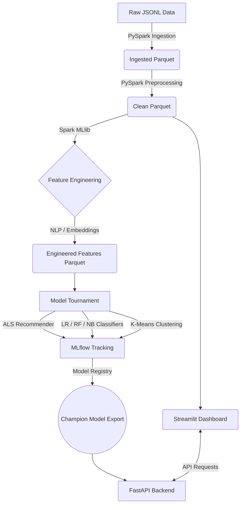

# Amazon Product Recommendation & Review Intelligence Platform
**DATA 228 — Final Project Report**


An end-to-end Big Data machine learning pipeline and interactive dashboard built on the [McAuley-Lab Amazon Reviews 2023](https://huggingface.co/datasets/McAuley-Lab/Amazon-Reviews-2023) dataset (~4.6M records). This project processes large-scale consumer review data to generate actionable business intelligence, customer personalization profiles, and intelligent product recommendations.

---

## 🎯 Executive Summary

This platform bridges the gap between heavy, offline Big Data processing and low-latency, online serving. It ingests raw JSONL datasets, cleans and engineers features using distributed PySpark, trains multiple machine learning algorithms tracked by MLflow, and ultimately serves the finalized models and analytics via a robust FastAPI backend and an interactive Streamlit frontend.

The resulting system features a fully functional recommendation engine powered by **Alternating Least Squares (ALS)**, sentiment and text classification models (Logistic Regression, Random Forest, Naive Bayes), and unsupervised clustering (K-Means).

### ✨ Key Features
*   **Customer Personalization (ALS):** Collaborative Filtering to predict how a user will rate unseen products.
*   **Review Intelligence (NLP):** Tokenization, TF-IDF, and classification to assess customer sentiment.
*   **Business Dashboard:** Interactive metrics and visualizations via Altair — rating distributions, product popularity, and user timelines.
*   **Microservice Architecture:** Fully decoupled Offline Pipeline and Online Serving Layer, containerized with Docker.

---

## 🛠 Technology Stack

| Category | Technology |
| :--- | :--- |
| **Language** | Python 3.10+ |
| **Big Data Engine** | Apache Spark / PySpark (Java 17) |
| **Data Storage** | Parquet, PyArrow |
| **Machine Learning** | Spark MLlib (ALS, LR, RF, NB, K-Means) |
| **MLOps** | MLflow (Experiment tracking, Model registry), SQLite |
| **Backend API** | FastAPI, Uvicorn |
| **Frontend/Dashboard** | Streamlit, Altair, Pandas |
| **DevOps** | Docker, Docker Compose, GitHub Actions, Pytest |
| **Data Source** | Hugging Face (McAuley-Lab/Amazon-Reviews-2023) |

---

## 🏗 System Architecture

The architecture separates the heavy **Offline** computation from the real-time **Online** serving.



### Storage Layers
- **Raw JSONL**: Raw, unprocessed text and metadata from the source.
- **Ingested Parquet**: Initial conversion for faster reads and reduced storage footprint.
- **Clean Parquet**: Nulls removed, schemas enforced, cold-start filtered — source of truth for the dashboard.
- **Engineered Features**: TF-IDF vectors and encoded categorical variables for ML models.

---

## 📊 Data Processing & Feature Engineering Pipeline

The pipeline runs as a modular set of Python scripts under `src/`, orchestrated by `start_pipeline.sh`.

### Step 1 — Data Ingestion & EDA (`src/ingestion/data_loader.py`, `src/eda/eda.py`)
- Reads JSONL streams using PySpark and converts them to Parquet.
- EDA calculates global rating distributions and identifies top-reviewed products.
- **Output:** `data/raw/amazon_reviews.parquet`

### Step 2 — Preprocessing (`src/preprocessing/cleaner.py`)
- Fills null values, casts data types, deduplicates records.
- Applies **Cold-Start Filtering** (minimum 5 reviews per user and per product).
- **Output:** `data/processed/amazon_clean.parquet/clean_data.parquet`

### Step 3 — Feature Engineering (`src/features/feature_engineering.py`)
- Builds Spark ML pipelines: `StringIndexer` → `Tokenizer` → `StopWordsRemover` → `HashingTF` → `IDF`.
- Encodes user IDs and product IDs as numeric indices for ALS.
- **Output:** `data/features/engineered_features.parquet` + `models/feature_pipeline`

---

## 🤖 Machine Learning & Model Tournament

All models are trained in `src/models/train.py` and tracked in MLflow.

### Collaborative Filtering — ALS (Recommendation)
- **Mechanism**: Matrix factorization that decomposes the user-item interaction matrix into lower-dimensional dense vectors.
- **Evaluation**: RMSE on a held-out test set — **ALS RMSE: 1.4381**

### Classification Models — Sentiment & Review Intelligence
- Models evaluated: **Logistic Regression**, **Random Forest**, **Naive Bayes**
- Classify review sentiment based on NLP-engineered TF-IDF features.

### Unsupervised Clustering — K-Means
- Groups similar reviews or products based on textual embeddings to discover hidden patterns.

### MLflow Experiment Tracking
- All metrics, hyperparameters, and model artifacts are logged to `mlruns/`.
- Best ALS model is exported to `models/als_recommendation_model`.
- View the UI: `mlflow ui --backend-store-uri sqlite:///mlruns.db`

---

## 🌐 Deployment & Online Serving Layer

Both services are containerized via Docker Compose and communicate over HTTP.

### FastAPI Backend (`api/main.py`)
| Endpoint | Description |
| :--- | :--- |
| `GET /health` | Health check |
| `GET /stats` | Aggregate dataset statistics from clean Parquet |
| `GET /users/{user_id}/top-products` | Highest-rated products for a given user |
| `POST /predict_sentiment` | Keyword heuristic sentiment analysis |

### Streamlit Dashboard (`dashboard/app.py`)
- **Business Dashboard**: KPI metrics, rating distributions, review volume over time.
- **Customer Personalization**: User review timeline, rating distribution, top-rated products.
- **Review Intelligence**: Real-time sentiment analysis via the FastAPI backend.

---

## 🧪 Testing & CI/CD

### Running Tests Locally
```bash
PYTHONPATH=. pytest tests/ -v
```

| Test File | Coverage |
| :--- | :--- |
| `tests/test_pipeline.py` | Config loading, module imports, directory structure |
| `tests/test_api.py` | FastAPI health check, sentiment analysis (positive/negative/neutral) |

**Latest results: 7/7 passed ✅**

### GitHub Actions (CI)
`.github/workflows/python-app.yml` automatically runs the full test suite on every `push` and `pull_request` to `main`. The workflow installs Java 17 for PySpark, installs all dependencies, and uploads a JUnit XML test report as an artifact.

---

## 🚀 Setup & Execution Guide

### Prerequisites
*   [Python 3.10+](https://www.python.org/downloads/)
*   [Java 17](https://adoptium.net/) (required locally for PySpark)
*   [Docker Desktop](https://www.docker.com/products/docker-desktop)

### 1. Install Dependencies
```bash
pip install -r requirements.txt
```

### 2. Download the Dataset
Download `.jsonl` files from [McAuley-Lab/Amazon-Reviews-2023](https://huggingface.co/datasets/McAuley-Lab/Amazon-Reviews-2023) and place them in `data/`.

### 3. Run the Offline Pipeline
```bash
chmod +x start_pipeline.sh
./start_pipeline.sh
```
*Takes several minutes. Populates `data/features/`, `models/`, and `mlruns/`.*

### 4. Boot the Online Serving Layer
```bash
docker-compose up --build -d
docker ps   # verify both containers are running
```

### 5. Access the Application
*   **Streamlit Dashboard:** [http://localhost:8501](http://localhost:8501)
*   **FastAPI Swagger UI:** [http://localhost:8000/docs](http://localhost:8000/docs)

---

## ⚙️ Configuration

All paths, ports, and URIs are centrally managed in **`configs/config.yaml`**. The `src/utils/config_loader.py` utility propagates these settings to every script — no hardcoded paths anywhere.

---

## 📂 Project Directory Map

```text
.
├── .github/workflows/
│   └── python-app.yml        # GitHub Actions CI — runs tests on every push/PR
│
├── README.md                 # This file — project documentation & report
├── RUN_EVIDENCE.md           # Pipeline run evidence and model metrics
├── Dockerfile                # Container definition (Python 3.10 + Java JRE)
├── docker-compose.yml        # Orchestration for API & Dashboard services
├── requirements.txt          # Python dependencies
├── start_pipeline.sh         # One-click offline pipeline runner
│
├── api/
│   └── main.py               # FastAPI application
│
├── configs/
│   └── config.yaml           # Centralized config (paths, ports, URIs)
│
├── dashboard/
│   └── app.py                # Streamlit dashboard
│
├── data/                     # Local Data Storage (mounted to Docker)
│   ├── features/             # ML-ready engineered features
│   ├── processed/            # Cleaned & filtered Parquet
│   └── raw/                  # Ingested Parquet from JSONL
│
├── mlruns/                   # MLflow experiment tracking & artifacts
│
├── models/
│   ├── als_recommendation_model/
│   └── feature_pipeline/
│
├── src/
│   ├── eda/eda.py
│   ├── features/feature_engineering.py
│   ├── ingestion/data_loader.py
│   ├── models/train.py
│   ├── preprocessing/cleaner.py
│   └── utils/config_loader.py
│
└── tests/
    ├── test_api.py            # FastAPI endpoint unit tests
    └── test_pipeline.py      # Smoke tests for config, modules, and directories
```

---

*This document serves as both the project README and the DATA 228 final project report, covering architecture, implementation, results, and deployment of a scalable recommendation and analytics pipeline.*
